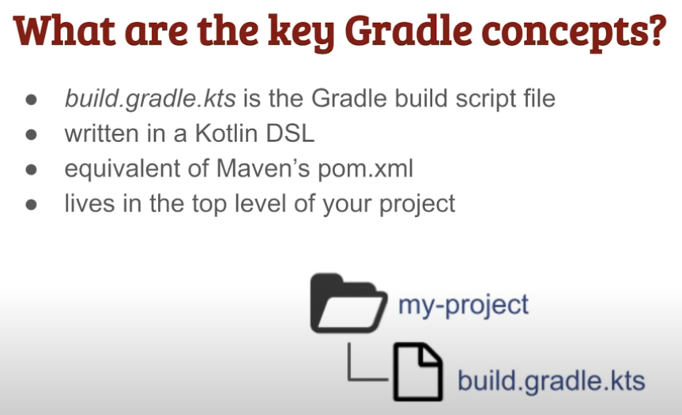
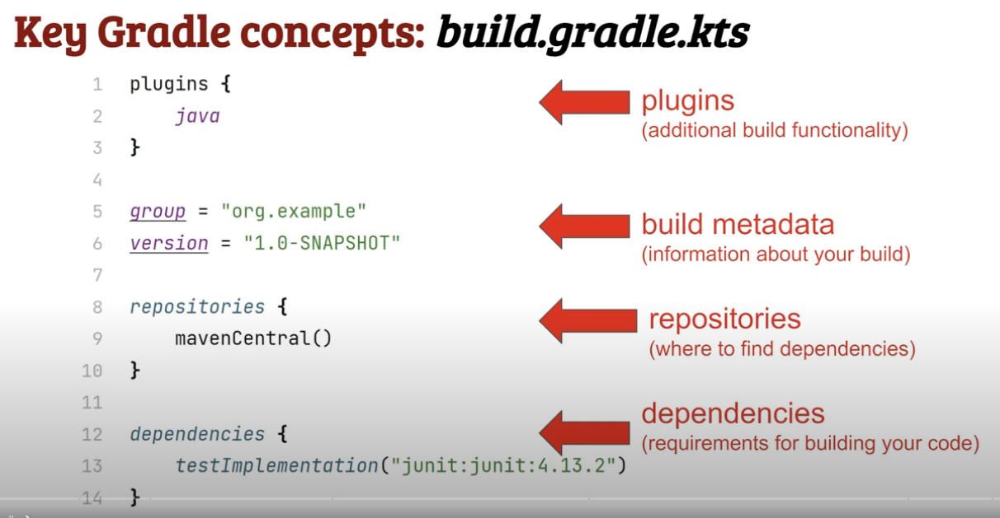
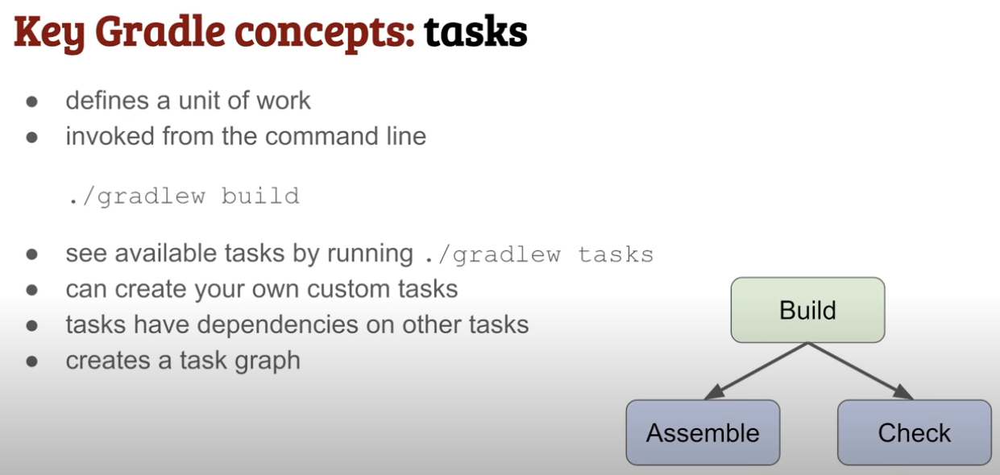
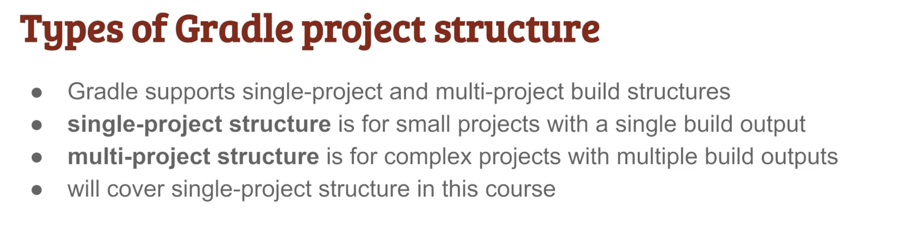
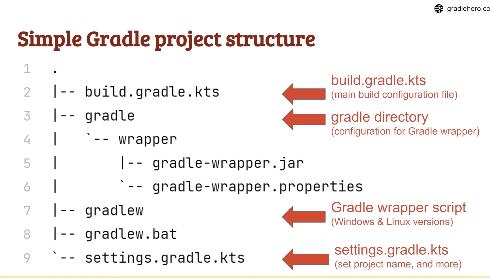

## Presentation
Gradle with Kotlin DSL - A Comprehensive Guide

### Slide 1: Introduction

#### Title: Introduction to Gradle & Kotlin DSLContent:

<b>What is Gradle?</b> Gradle is a powerful build automation tool used for JVM-based projects, including Java, Kotlin, and Android.

<b>Why Kotlin DSL instead of Groovy?</b> Kotlin DSL provides better type safety, IDE support, and modern syntax compared to Groovy.

<b>Overview of a Gradle</b> project structure: Gradle projects typically contain build.gradle.kts, settings.gradle.kts, and structured source directories.

### Slide 2: Setting Up a Gradle Project

#### Title: Getting Started with Gradle Kotlin DSLContent:

<b>Installing Gradle:</b> Install Gradle via SDKMAN, Homebrew, or direct download.

<b>Creating a new project (gradle init):</b> Use the gradle init command to create a new Kotlin DSL-based project.

<b>Understanding build.gradle.kts & settings.gradle.kts:</b> These files define dependencies, plugins, and settings.

### Slide 3: Plugins & Dependencies

<b>Title</b>: Declaring Plugins and DependenciesContent:

<b>Applying plugins</b>: Plugins like java, application, and kotlin enable various functionalities.

<b>Adding dependencies</b>: Declare dependencies using implementation, testImplementation, and runtimeOnly.

<b>Using a dependency version catalog</b>: A structured way to manage dependencies in libs.versions.toml.

### Slide 4: Configuring Tasks

<b>Title</b>: Customizing Gradle TasksContent:

<b>Creating custom tasks</b>: Define tasks using tasks.register<Copy>("taskName").

Task dependencies (dependsOn, mustRunAfter): Control execution order of tasks.

Using doFirst and doLast: Add actions before or after a task runs.

### Slide 5: Gradle Build Lifecycle

Title: Understanding Build PhasesContent:

Initialization Phase: Sets up Gradle and identifies projects.

Configuration Phase: Evaluates build scripts and task dependencies.

Execution Phase: Executes required tasks like compile, test, build.

### Slide 6: Multi-Module Projects

Title: Working with Multi-Module ProjectsContent:

Structuring a multi-module project: Each module has its own build.gradle.kts.

Configuring settings.gradle.kts: Register subprojects with include("module-name").

Sharing dependencies across modules: Use allprojects {} or subprojects {} to apply common dependencies.

### Slide 7: Advanced Topics

Title: Advanced Gradle ConceptsContent:

Writing reusable Gradle scripts: Extract logic into .gradle.kts script files.

Using properties & environment variables: Store configurable settings for builds.

Optimizing builds with caching & parallel execution: Improve performance with gradle.properties settings.

### Slide 8: Best Practices & Conclusion

Title: Best Practices & ResourcesContent:

Comparing Kotlin DSL vs. Groovy DSL: Kotlin offers better static typing and IDE support.

Common pitfalls to avoid: Avoid unnecessary complexity, use structured dependencies.

Recommended resources: Gradle official docs, Kotlin DSL samples, Gradle forums.

### gradle-understanding

tactiq.io free youtube transcript
Gradle Course for Beginners | Get Going with Gradle
https://www.youtube.com/watch/R6Z-Sxb837I
<pre>
00:00:00.359 hello and welcome to get going with
00:00:02.000 gradle the fastest way to a working
00:00:04.440 knowledge of gradle before we get
00:00:06.480 started here's a quick overview of what
00:00:08.719 to expect from this course and how to
00:00:10.840 make the most of it who is this course
00:00:13.080 for this course is specifically for
00:00:15.480 anyone in one of these scenarios you
00:00:18.000 have no grade or knowledge and you want
00:00:19.720 to get started fast this course will
00:00:22.119 help you get there you might have use
00:00:24.279 gradle for a while but aren't confident
00:00:26.400 making changes to a build or you know
00:00:29.279 some gradle but want to better
00:00:31.000 understand the fundamentals before
00:00:32.640 learning about more advanced topics if
00:00:35.360 any of these sounds like you then you're
00:00:37.280 in the right place what will you learn
00:00:40.239 by the time you reach the end of this
00:00:41.680 course you'll understand when to use
00:00:43.640 gradle have created your first gradle
00:00:46.199 project be able to create a simple Java
00:00:48.760 project in
00:00:49.800 gradle understand the key aspects of a
00:00:52.120 gradle build script and know how to
00:00:54.480 write simple code in Kotlin the gradle
00:00:56.840 scripting language ultimately by the end
00:00:59.920 you'll be more confident and effective
00:01:01.519 working with gradle with a solid
00:01:03.519 foundation on which you can build in the
00:01:05.560 future finally here's some information
00:01:08.119 about how you can make the most of this
00:01:09.840 course some lessons are theoretical
00:01:12.280 where you just need to understand the
00:01:13.680 concepts others are practical where
00:01:15.799 you'll get the most benefit by actually
00:01:17.520 doing the steps yourself you'll find
00:01:19.960 full step-by-step instructions below
00:01:22.119 each practical and you can slow down or
00:01:24.759 speed up videos as you like that's
00:01:27.320 everything you need to know before
00:01:28.600 beginning this course now it's time to
00:01:30.960 get going with gradle I look forward to
00:01:33.040 seeing you in the next lesson which is
00:01:34.799 an introduction to

00:01:36.600 gradle welcome to this first lesson
00:01:39.200 where you'll get a high level overview
00:01:40.759 of gradle including what it is why you
00:01:43.040 would use it why it's so powerful and
00:01:45.759 what makes it better than other build
00:01:47.320 tools let's get right into it so first
00:01:50.119 up let's answer the question what is
00:01:52.040 gradle primarily it's build automation
00:01:54.719 tool a build automation tool takes all
00:01:57.280 the code in your project and packages it
00:01:59.520 into into a Deployable unit that can be
00:02:01.680 run in the Target environment gradle can
00:02:04.560 be used to build small or large projects
00:02:07.280 gradle will builds are written in Kotlin
00:02:09.318 the scripting language built on top of
00:02:11.560 java virtual machine jvm you can also
00:02:15.080 write gradle build scripts using another
00:02:16.959 jvm language called groovy in this
00:02:19.640 course we'll focus on the recommended
00:02:21.480 Kotlin version in later lessons we'll
</pre>
 
<pre>
00:02:24.080 look into a few important
00:02:25.319 characteristics of Kotlin that enable
00:02:27.720 you to properly understand gradle or build
00:02:30.239 scripts finally Gradle is highly
00:02:32.959 configurable that means that even if you
00:02:35.120 have some obscure requirement in your
00:02:36.920 build you'll almost certainly find a way
00:02:39.239 to do it in gradle here are four
00:02:41.760 compelling reasons why you would use
00:02:43.599 gradle gradle makes building and running
00:02:46.200 applications very easy because it's
00:02:48.360 specifically designed for this purpose
00:02:50.879 it's very likely that if you try to
00:02:52.440 create a build mechanism yourself of
00:02:54.280 your application from scratch you'll
00:02:56.519 waste a lot of time and end up with
00:02:58.640 something not as perform and streamlined
00:03:01.040 as you would with gradle there's no need
00:03:03.599 for people using your projects to
00:03:05.159 install gradle that's because the gradle
00:03:07.560 rer script which we'll talk about later
00:03:09.920 comes bundled with gradle projects just
00:03:12.799 download a get repository and run/
00:03:15.440 gradlew space build to build the
00:03:17.560 project it's that simple it's very
00:03:20.480 concise and less verbose than tools like
00:03:22.599 Maven because the build is defined in
00:03:24.959 code and not XML it's very performant
00:03:28.200 and supports incremental builds so you
00:03:30.360 don't do the same things multiple times
00:03:32.680 unnecessarily for example it won't rerun
00:03:35.120 the same tests if the code hasn't
</pre>

 
<pre>
00:03:37.360 changed what are the key gradle Concepts
00:03:40.560 we'll cover each of these in more detail
00:03:42.480 later but here's a quick overview of the
00:03:44.760 most important components of gradle
00:03:47.439 concept one is the build. gr. kts file
00:03:50.840 which is your gradle build script where
00:03:52.840 you define how your project is built
00:03:55.480 it's written in Kotlin and uses a gradle
00:03:57.920 to main specific language d L to make
00:04:00.840 defining your build as concise as
00:04:02.879 possible all this means is that it uses
00:04:05.280 some special Kotlin language features
00:04:07.000 we'll cover later to keep things neat
00:04:08.879 and tidy if you've used Maven before the
00:04:11.920 build.gradle.kts file is equivalent to
00:04:14.760 maven's pom.xml file finally before we
00:04:18.238 get into an example the build.gradle.kts   
00:04:21.440 lives at the top level of your project
00:04:24.080 it's time to jump into a simple gradle or
00:04:26.160 build script example don't worry about
00:04:29.080 understanding every detail for now

00:04:30.680 because we'll cover this again later on
00:04:33.400 plugins are the main way for you to add
00:04:35.160 more functionality to your build here we
00:04:37.680 have the Java plugin which adds
00:04:39.360 capabilities like compiling Java code
00:04:41.919 and running tests you'll see exactly how
00:04:44.440 this works later metadata such as your
00:04:47.720 Project's group and version are
00:04:49.560 important to specify they get used in
00:04:52.120 different places in your build like in
00:04:53.840 the naming of artifacts such as Java jar
00:04:56.639 files if you're wondering where the
00:04:58.560 project name is specified
00:05:00.120 that's in a different file settings. gr.
00:05:02.680 kts which we'll explore later on
00:05:05.840 repositories is where your builds
00:05:07.520 dependencies are downloaded from a very
00:05:10.120 common repositories for Java projects is
00:05:12.440 Maven Central grade will also supports
00:05:15.520 Google and you could even specify your
00:05:17.520 own private
00:05:18.880 repository dependencies are artifacts
00:05:21.639 that are required in order to build your
00:05:23.759 project during your build grade or
00:05:26.240 downloads the dependencies from the
00:05:28.199 specified repositories
00:05:30.360 common examples include junit for
00:05:32.440 running tests and spring boot for
00:05:34.319 building web
</pre>
 
<pre>
00:05:36.039 applications the next key concept to
00:05:38.680 understand is the gral task a task
00:05:41.759 defines a unit of work to be executed in
00:05:44.000 your build this could be anything from
00:05:46.240 compiling your code to publishing it to
00:05:48.440 a remote repository you can invoke one
00:05:51.400 or many tasks from the command line
00:05:54.120 here's an example of running the build
00:05:55.840 task which compiles and tests a project
00:05:59.039 if you're Wonder wondering what the/
00:06:00.840 gradle w means that's just how you invoke
00:06:03.520 gradle you'll learn more in a moment you
00:06:06.639 can see a list of available tasks in
00:06:08.639 your project by running dog gradle w space
00:06:11.840 tasks and you can create your own custom
00:06:14.400 tasks if the functionality you need
00:06:16.280 doesn't already exist tasks can have
00:06:19.319 dependencies on other tasks this means
00:06:21.960 that the task which is depended on gets
00:06:24.000 run first all the dependencies between
00:06:27.520 tasks in a project create what is called
00:06:29.960 the gradle task graph here's how sum of
00:06:32.840 the task graph looks for the build task
00:06:35.280 the build task depends on the assemble
00:06:37.440 task which packages the application and
00:06:40.199 the check task which runs
00:06:42.759 tests the final key gradle concept is
00:06:45.639 the wrapper which is a script which you
00:06:47.720 use to invoke gradle and run tasks in
00:06:50.960 the previous slide we talked about the
00:06:52.479 build task how do you run it in Mac or
00:06:55.919 Linux environments withg gradle WS space
00:06:59.120 build build in Windows environments with
00:07:01.599 gradlew.bat space build importantly the
00:07:05.400 rapper script is always committed into
00:07:07.479 your Project's Version Control System
00:07:10.120 this means when someone wants to build
00:07:11.680 your project they don't need to have
00:07:13.319 gradle installed on their machine they
00:07:15.639 just check out your project and build it
00:07:18.199 the gradle rapper also contains a
00:07:20.319 specific version of gradle this avoids
00:07:22.879 any incompatibility problems since you
00:07:25.160 know that your Project's build works
00:07:26.840 with the specified
00:07:28.319 version for these reasons you should
00:07:30.560 always use the gradle rapper script by
00:07:32.680 running dog gradle W or gradlew.bat the
00:07:36.800 only time you wouldn't use the gradle
00:07:38.360 wrapper is when you need to initialize a
00:07:40.400 new gradle project which you can do
00:07:42.479 using a local gradle installation we'll
00:07:45.000 cover that in a practical later
00:07:47.159 on before we complete this lesson here
00:07:49.720 are the key points to remember gradle is
00:07:52.319 a modern customizable build automation
00:07:54.680 tool grade or build scripts are written
00:07:57.120 in the Kotlin programming language the
00:07:59.800 build script is contained in a
00:08:01.319 build.gradle kts file the build script
00:08:05.120 has plugins metadata repositories and
00:08:08.759 dependencies tasks in gradle represent a
00:08:11.400 unit of work and are linked together in
00:08:13.560 the gradle task graph you run tasks
00:08:17.159 using the gradle rapper script checked
00:08:19.240 into Version Control see you in the next
00:08:22.800 lesson welcome back in this lesson
00:08:25.319 you'll install gradle on your machine so
00:08:27.560 it's ready to use in the rest of the
00:08:29.560 course whether you're a Windows Linux or
00:08:32.279 Mac User I'll cover the steps you need
00:08:34.279 to take one important point because gral
00:08:37.479 runs in Java you need the Java jdk
00:08:40.320 installed at the time of recording Java
00:08:43.000 17 is the most recent long-term support
00:08:45.800 version compatible with gradle and
00:08:48.000 you'll find a download link in the notes
00:08:50.240 below here's an overview of the steps
00:08:52.720 will follow to install gradle first off
00:08:55.720 we'll validate that Java is installed
00:08:57.880 properly second second we'll download
00:09:00.079 gradle and set it up in our environment
00:09:02.880 finally we'll validate the gradle has
00:09:04.680 been installed I've run through
00:09:06.920 installation separately for Windows then
00:09:09.480 Linux environments and if you're on a
00:09:11.959 Mac you can use the Brew package manager
00:09:13.959 to install gradle which I'll cover at
00:09:16.120 the end follow along with these steps as
00:09:18.600 I do them or watch the full video then
00:09:21.240 complete the step-by-step instructions
00:09:23.839 below let's start by installing gradle
00:09:26.519 on Windows start by validating your Java
00:09:30.120 installation open a Windows command
00:09:32.440 prompt and type Java Das version it
00:09:36.279 should print details of your current
00:09:37.839 Java installation gradle works with
00:09:40.360 versions eight and above now it's time
00:09:42.800 to download gradle go to gr. org
00:09:49.600 relases select the most recent gradle
00:09:52.040 release at the time of recording that
00:09:54.160 was
00:09:55.040 8.4 choose the binary only option and
00:09:57.959 click the link to download the zip file
00:10:00.120 to your computer you'll now create a
00:10:02.360 gradle directory on your hard drive and
00:10:04.880 extract the zip file into that directory
00:10:07.760 open File Explorer navigate to your hard
00:10:10.279 drive and create a new
00:10:13.360 folder call it gradle then navigate to
00:10:16.920 the zip file you just downloaded right
00:10:19.640 click extract all and extract it to the
00:10:22.959 new gradle
00:10:25.279 directory you should now have a new
00:10:27.320 directory in the gradle directory
00:10:29.640 go into that directory then into bin and
00:10:33.200 copy the path from the address
00:10:35.680 bar now we'll configure the path
00:10:38.040 environment variables that you can run
00:10:39.639 gradle commands from wherever you are in
00:10:41.839 the command prompt bring up the system
00:10:45.079 properties dialogue which you can do by
00:10:47.279 typing environment variables into the
00:10:49.480 start menu click environment
00:10:52.240 variables then under system variables
00:10:54.680 double click path and we'll add a new
00:10:57.360 entry to path and paste in the value you
00:11:00.200 copied
00:11:01.279 earlier hit okay okay again and okay
00:11:04.600 again open a new Windows command prompt
00:11:07.959 and we'll validate the gradle
00:11:09.480 installation with gradle --
00:11:12.680 version you should see some output
00:11:14.760 showing that a specific version of
00:11:16.360 gradel is installed if you're a Windows
00:11:18.680 user well done that's all you need to do
00:11:20.839 before moving on to the next lesson now
00:11:23.600 let's cover installing gradle on Linux
00:11:26.480 I'll set this up in auntu Linux but
00:11:28.760 these steps should be similar for other
00:11:31.720 distributions within an abun 2 Terminal
00:11:34.160 window validate that Java is installed
00:11:36.639 with Java Das verion it should print out
00:11:39.720 details of your current Java
00:11:41.360 installation gradle works with versions
00:11:43.839 eight and above download the latest
00:11:46.160 version of Gradle using this C
00:11:49.040 command then unzip the file to opt SLG
00:11:52.440 gradle using this
00:11:54.240 command if prompted for your password
00:11:56.959 enter it because you're running this
00:11:58.360 command as as the root
00:12:01.600 user look at the contents of the gradle
00:12:04.240 installation using the ls command you
00:12:07.279 should see some files and
00:12:08.920 directories set up your path environment
00:12:11.480 variable by adding this entry to the
00:12:14.279 bashrc file with this command now close
00:12:17.440 the terminal and open a new one and
00:12:20.160 validate that gradle has been
00:12:21.480 successfully installed with gradle D-
00:12:24.639 version you should see some output
00:12:26.800 showing that a specific version of
00:12:28.320 gradle is installed if you're a Linux
00:12:30.600 user well done that's all you need to do
00:12:32.760 before moving on to the next
00:12:34.760 lesson finally before we finish this
00:12:37.320 lesson here are some other installation
00:12:39.600 options if you're using a Mac you can
00:12:42.000 use the Brew package manager to install
00:12:44.079 gradle just run Brew install gradle if
00:12:47.880 you're using the SDK man package manager
00:12:50.560 the command is SDK install Gradle then
00:12:53.800 the gradle version whatever your
00:12:56.320 environment you should now have Gradle
00:12:58.079 installed see you in the next
</pre>
 
<pre>
00:13:00.639 lesson in this short lesson you'll learn
00:13:03.120 the basic structure of a gradle project
00:13:05.399 in preparation for building your first
00:13:07.160 gradle project in the later
00:13:09.279 lesson before we get into the structure
00:13:11.519 of a simple project note that gradle
00:13:13.880 does support both single project and
00:13:16.040 multi-project build structures if you've
00:13:18.560 used Maven before you might be familiar
00:13:20.839 with these Concepts a single project
00:13:23.320 structure is normally what you use when
00:13:25.079 you have a small project to build which
00:13:27.040 produces a single build output
00:13:29.839 multi-project structure is used for
00:13:32.000 complex project which is split into
00:13:34.279 several distinct components Each of
00:13:36.600 which may produce their own build
00:13:38.320 outputs in this introductory gradle
00:13:40.680 course we'll explore the single project
00:13:42.959 structure which is more than sufficient
00:13:45.079 for many real world use
00:13:46.959 cases what you see here is the file
</pre>
 
<pre>
00:13:49.399 structure of a simple single project
00:13:51.440 gradle build in fact the project is so
00:13:54.240 simple that the only files here are
00:13:56.240 related to gradle itself this allows us
00:13:59.040 to really understand which files are
00:14:00.800 gradle specific before we start adding
00:14:03.240 code to our project in later lessons
00:14:06.040 build. gr. kts is the main file where we
00:14:08.920 Define how our gradle build should work
00:14:11.240 including adding plugins metadata
00:14:13.920 repositories and dependencies we'll
00:14:16.279 cover it again in more detail in later
00:14:18.920 lessons the gradle directory contains
00:14:21.560 code and configuration for the gradle
00:14:23.399 wrapper there are the gradle wrapper
00:14:25.399 scripts themselves including gradle W
00:14:27.720 for Linux and Mac environments and
00:14:30.000 gradlew.bat for Windows these are both
00:14:33.279 committed into Version Control so your
00:14:35.680 project can automatically be built in
00:14:37.440 any environment without installing
00:14:39.519 gradle separately the settings. gr. kts
00:14:43.320 file contains additional configuration
00:14:45.240 for your project outside of the
00:14:47.240 build.gradle
00:14:48.639 kts importantly here you specify the
00:14:51.639 project name which gets used in various
00:14:53.959 places like in the naming of generated
00:14:56.160 build
00:14:57.279 artifacts important importantly all the
00:14:59.440 files and directories from the previous
00:15:01.320 slide should be committed into Version
00:15:03.759 Control there is one additional hidden
00:15:06.160 directory the do gradle directory which
00:15:08.560 should not go into Version Control this
00:15:11.000 is a Project Specific cache used
00:15:13.120 internally by gradle we don't need to
00:15:15.040 know any more details other than that it
00:15:17.199 should be added to your dogit ignore
00:15:18.920 file and not committed to Version
00:15:21.720 Control fortunately when you use gradle
00:15:24.399 to generate your project it
00:15:26.000 automatically generates the correct dog
00:15:28.800 nor file but it's important to know what
00:15:31.199 is and isn't stored in Version Control
00:15:34.279 see you in the next
00:15:36.040 lesson welcome back in this lesson
00:15:38.639 you're finally going to create a gradle
00:15:40.440 project and see with your own eyes why
00:15:42.600 it's such an amazingly useful tool this
00:15:45.680 is another practical where you should
00:15:47.560 complete the provided steps yourself so
00:15:50.079 what will we be doing we use the gradle
00:15:52.759 installation you set up earlier to run
00:15:54.600 the gradle init command this bootstraps
00:15:57.639 a brand new gradle project the time to
00:16:00.160 use gradle init is when you're starting
00:16:02.040 a new project or working with an
00:16:04.160 existing project which doesn't use
00:16:06.000 gradle yet and you want to automatically
00:16:08.360 generate all the necessary grade or
00:16:10.160 build files the grade linit command
00:16:13.040 comes with a setup wizard which will run
00:16:15.319 through to understand the different
00:16:17.319 options once the project has been
00:16:19.480 generated we'll step through each of the
00:16:21.800 new files and
00:16:23.319 directories just like with a real
00:16:25.319 project we'll commit the project into
00:16:27.120 Version Control using git and whether
00:16:30.199 you're using Linux Mac or a Windows
00:16:32.360 environment you'll find step-by-step
00:16:34.519 instructions below this
00:16:36.600 video open up a terminal and navigate to
00:16:39.440 home directory I'm in a Linux terminal
00:16:42.160 here but you can find the equivalent
00:16:43.920 Windows commands in the notes below this
00:16:46.560 video create a directory for the project
00:16:49.360 called get going with gradle type mkd
00:16:53.120 get going with gradle and hit
00:16:56.199 enter navigate into the directory with
00:16:59.079 CD get going with gradle and hit enter
00:17:02.720 at this point we're in a new empty
00:17:04.400 directory so you can create our gradle
00:17:06.959 project type the command gradle in it
00:17:10.079 and hit
00:17:11.240 enter this initializes the gradle setup
00:17:14.079 wizard which will ask us several
00:17:16.160 questions about the project we want to
00:17:18.079 create the first question is what type
00:17:20.640 of project we want basic application
00:17:23.400 library or a gradle plugin we'll create
00:17:26.199 a basic project so type one then hit
00:17:29.120 enter next we choose Kotlin or groovy
00:17:32.200 build scripts we're using Kotlin on this
00:17:34.720 course so type one and hit enter next we
00:17:38.320 choose a name for our project grade or
00:17:40.640 defaults to the name of the directory
00:17:42.559 we're in which is fine so just hit enter
00:17:46.240 finally it asks if we want to use new
00:17:48.559 apis and behavior these are liable to
00:17:51.400 change in future so hit enter to accept
00:17:54.080 the default no it says build successful
00:17:57.520 so that's it we now have a simple gradle
00:17:59.960 project called get going with
00:18:02.159 gradle let's try interacting with the
00:18:04.559 project by running a gradle task
00:18:07.200 remember we should always use the gradle
00:18:08.919 wrapper to run tasks so type gradle w
00:18:13.000 space help and hit
00:18:16.000 enter the first time you run this it may
00:18:18.480 take some time to download gradle from
00:18:20.440 the
00:18:23.200 internet but eventually the help task
00:18:25.720 prints some useful getting started
00:18:27.480 information
00:18:28.880 it says to see a list of available tasks
00:18:31.280 run gradle W tasks let's try that type dog
00:18:35.960 grw space tasks and hit
00:18:40.120 enter this prints out all the tasks we
00:18:42.799 can run in our project because the
00:18:45.120 project doesn't build anything yet there
00:18:47.000 isn't much very useful we can do that
00:18:49.679 said it does list here the init task and
00:18:52.400 the tasks task which we've just run just
00:18:55.520 for fun pick one of the help tasks at
00:18:57.559 random and run it
00:18:59.000 I'll run/ gradle w space
00:19:03.039 dependencies which correctly says there
00:19:05.039 are no dependencies in this
00:19:08.400 project now let's have a look at the
00:19:10.440 different files in our project that were
00:19:12.120 created by gradle type ls- L and hit
00:19:15.640 enter we can see the build. gr. kts file
00:19:19.360 the main build script the Gradle
00:19:21.840 directory containing the gradle wrapper
00:19:24.120 configuration the two gradle wrapper
00:19:26.760 scripts and the settings. gr. kts file
00:19:31.080 let's have a look inside the
00:19:32.200 build.gradle
00:19:33.440 kts type cat space build.gradle kts and
00:19:38.000 hit enter there's nothing here except a
00:19:40.600 comment for now but it's ready for us to
00:19:42.720 add some build logic later on now let's
00:19:45.720 look inside settings. gr. kts type cat
00:19:49.720 space settings. gr. kts and hit enter on
00:19:53.640 the last line you can see that the name
00:19:55.400 of this project has been set to get
00:19:57.440 going with grad
00:19:58.799 because that's the name we selected in
00:20:00.520 the setup
00:20:01.720 wizard let's take a look at any hidden
00:20:04.120 files or directories so type
00:20:06.520 l-la and hit enter the files and
00:20:09.559 director starting with a doter hidden
00:20:12.000 we've got two files dogit attributes and
00:20:14.799 dog ignore and a hidden directory do
00:20:17.760 Gradle as mentioned before the do Gradle
00:20:20.799 directory is used internally by gradle
00:20:23.480 and shouldn't be committed into Version
00:20:25.360 Control the dogit ignore file has been
00:20:28.240 generated automatically by grador take a
00:20:31.039 look inside by typing catspace dog
00:20:33.840 ignore then hit enter we can see two
00:20:36.559 directories being ignored the doc gradle
00:20:39.039 directory we've just seen and a build
00:20:42.039 directory where your Project's build
00:20:43.840 outputs go which we'll talk about later
00:20:46.360 the build directory doesn't exist yet
00:20:48.360 because we haven't built anything
00:20:50.600 because these files are in the dockit
00:20:52.280 ignore file they won't be included when
00:20:54.640 we commit this project to a git
00:20:57.120 Repository speaking of which the last
00:20:59.960 thing to do now is to commit this
00:21:01.600 project into Version Control we need to
00:21:04.480 initialize this directory as a git
00:21:06.440 repository so type git in it and hit
00:21:11.039 enter let's get all the files ready to
00:21:13.480 be committed type git add Dot and hit
00:21:17.559 enter now type git status and hit enter
00:21:21.440 to see what files are staged for commit
00:21:24.559 notice that everything is going to be
00:21:26.080 committed except the dot get IGN
00:21:28.799 directory let's commit all this so type
00:21:31.480 git commit
00:21:33.200 DM initialize project and hit
00:21:37.880 enter good work you've just created your
00:21:40.279 first gradle project before we finish
00:21:43.200 this lesson here's a quick summary of
00:21:44.960 what you've just achieved you've used
00:21:47.240 gradle init to initialize a basic gradle
00:21:49.559 project using the setup wizard remember
00:21:52.640 the options you selected were a basic
00:21:54.799 project using the Kotlin language for
00:21:57.120 the build script using the project name
00:21:59.720 from the directory name of get going
00:22:01.760 with gradle and not using new apis and
00:22:04.880 behavior which may change in future you
00:22:08.159 then initialized the project as a git
00:22:10.039 repository and committed only the
00:22:12.200 relevant gradle files and directories
00:22:14.159 into Version Control see you in the next
00:22:17.880 lesson welcome back and in this lesson
00:22:20.520 we're going to talk about one of the
 
00:22:21.880 most common use cases for gradle which
00:22:24.279 is to create a Java project let's first
00:22:27.480 put gradle aside and consider the most
00:22:29.640 important requirements for building a
00:22:31.400 Java project you'll then see how gradle
00:22:34.320 handles each of these
00:22:35.799 requirements one compile classes in a
00:22:39.080 Java project we have Java classes files
00:22:41.919 with a Java extension that need to be
00:22:44.559 compiled into executable do class files
00:22:47.960 these class files are then executed in
00:22:50.320 our deployment environment to run our
00:22:52.440 application so our first requirement is
00:22:54.880 to compile Java classes into doc class
00:22:57.559 files
00:22:58.960 two manage resources there may be
00:23:01.559 additional resources other than Java
00:23:03.640 classes that need to go into our Target
00:23:05.960 environment this could be text files
00:23:08.559 images or anything else which needs to
00:23:10.640 live alongside the code all of this
00:23:12.760 needs to be properly managed three
00:23:15.320 package we need a mechanism to easily
00:23:18.039 package the compiled classes and
00:23:19.559 resources into a Java jar file a jar
00:23:22.840 file is just a zip file in a specific
00:23:25.039 format that Java recognizes and it's a
00:23:27.640 lot easier to manage than handling
00:23:29.320 directories and files four run tests
00:23:33.559 we'd like a mechanism to easily run
00:23:35.520 tests alongside our code importantly
00:23:38.600 though the tests shouldn't be packaged
00:23:40.440 into the final build artifact as they're
00:23:42.679 not required to execute the application
00:23:45.559 and five Define dependencies it would be
00:23:48.559 great to have a way to manage
00:23:50.120 dependencies in our Java project rather
00:23:53.000 than writing code from scratch in every
00:23:54.919 project we often pull in other libraries
00:23:57.240 to help do this the heavy lifting some
00:23:59.480 popular Java libraries include Apache
00:24:01.559 Commons and spring boot having a way to
00:24:04.240 define all these dependencies with their
00:24:06.240 versions would be super helpful of
00:24:08.919 course there may be other requirements
00:24:10.320 with more complex projects but this list
00:24:12.799 provides a good starting point so how
00:24:15.039 can gradle help with this it turns out
00:24:18.039 that it's extremely simple to set up a
 
00:24:20.000 Java project with gradle all you have to
00:24:22.600 do is apply the Java plug-in which adds
00:24:25.120 all the functionality you need to meet
00:24:27.120 the requirements we just covered
00:24:29.480 remember in the introduction to gradle
 
00:24:31.279 lesson when we were talking about
00:24:32.600 plugins in the build. gr. kts file well
00:24:36.559 to apply the Java plug-in all you have
00:24:38.679 to do is add an entry into the plug-in
00:24:40.799 section of the build. gradle or. kts like
00:24:44.679 this with this plugin applied your
00:24:47.159 gradle project gets configured in a
00:24:49.080 certain way and some additional tasks
00:24:51.520 become available that's what plugins do
00:24:54.240 they add new functionality to your
00:24:56.399 project the J Java plugin is one of the
00:24:58.840 core gradle plugins that means it's
00:25:01.480 important enough that it's bundled up
00:25:03.279 with the gradle distribution and
00:25:05.279 maintained by the gradle team in the
00:25:08.200 rest of this lesson we'll look at what
00:25:09.799 functionality the Java plug-in brings to
00:25:11.760 a project and what specific structure it
00:25:14.520 expects a project to have our first
00:25:17.640 requirement for a Java project was to
00:25:19.480 compile classes the Java plugin helps us
00:25:22.480 do this through a task called compile
00:25:24.720 Java you can run this task like you
00:25:27.039 would any other gradle task withg gradle
00:25:29.840 W compile Java this task uses whatever
00:25:33.240 Java installation is set up in your
00:25:35.000 environment to compile your projects
00:25:37.600 Java files into class files these class
00:25:41.480 files get output into the gradle build
00:25:43.600 directory which is a directory where any
00:25:46.000 generated build outputs from gradle get
00:25:48.480 created here's an example with a Java
00:25:50.919 class my first class in a com. gradle
00:25:53.760 hero
00:25:54.919 package when we run the compile Java
00:25:57.320 task the do class file gets output into
00:25:59.960 the build slcl classes directory with a
00:26:02.440 similar directory structure don't worry
00:26:05.320 about the details of the directories for
00:26:07.159 now because I'll explain the structure
00:26:09.159 in full later in the lesson what's
00:26:11.480 important to remember is just that the
00:26:13.120 compiled classes go into the build
00:26:15.320 directory the next requirement for a

 
00:26:17.520 Java project was to manage resources you
00:26:20.320 guessed it the Java plug-in lets us do
00:26:22.240 this through another task the task is
00:26:24.520 called process resources you run this
00:26:26.960 task using /gr orw process resources the
00:26:30.720 task looks in specific directories in
00:26:33.000 your project which have been marked as
00:26:34.600 resources directories and copies the
00:26:36.960 contents into the build directory the
00:26:39.360 reason it's called process resources is
00:26:41.640 that it can do additional processing
00:26:43.520 along the way such as finding and
00:26:45.279 replacing strings here's an example with
00:26:48.080 a text file called super important. txt
00:26:51.360 in a Resources directory when we run the
00:26:54.640 process resources task text file gets
00:26:57.159 copied into into the build directory
00:26:58.880 with a similar directory structure I'll
00:27:01.520 go over the directory structure in more
00:27:03.240 detail later but just know for now that
00:27:05.559 process resources copies resources into

 
00:27:08.120 the build directory the next requirement
00:27:10.840 for Java project was to package our
00:27:12.840 compiled classes and resources into a
00:27:15.200 jar file unsurprisingly there's another
00:27:17.799 gradle task for this can you guess what
00:27:19.640 it's called that's right the Java plugin
00:27:21.960 adds a jar task which you run usingg grw
00:27:25.520 jar the jar task takes all the compiled
00:27:28.440 classes and resources from the build
00:27:30.240 directory and adds them to a jar file
00:27:33.080 the name of the jar file is Project
00:27:34.840 name- version. jar it uses the build
00:27:37.960 metadata we saw earlier to finded in the
00:27:40.200 build.gradle kts and settings. gr. kts
00:27:44.279 files here's an example of a project
00:27:46.720 with classes and resources the jar task
00:27:49.799 packages them into a jar file in the
00:27:51.840 build slbs directory you can try
00:27:55.000 building a jar file yourself in the next
00:27:56.919 lesson which is a practical all about
00:27:59.240 creating your first Java project with
00:28:01.559 gradle the next requirement for a Java
 
00:28:04.000 project was to easily run tests that's
00:28:06.880 achieved with a task called test which
00:28:09.399 you run usingg grw test what this does
00:28:13.240 is compile your test code process any
00:28:15.399 test resources then run the tests the
00:28:18.679 other nice thing it does is produce a
00:28:20.559 pretty test report in the build
00:28:22.919 directory the report tells us what's
00:28:25.240 passed and what's failed in this case
00:28:27.720 it's a 100% success rate the final
00:28:31.159 requirement we had for Java project was
00:28:33.279 to easily Define
 
00:28:35.039 dependencies the way dependencies are
00:28:37.159 managed in gradle is in the dependencies
00:28:39.720 section of build.gradle kts which we
00:28:42.679 discussed briefly earlier as a reminder
00:28:45.600 a dependency definition looks like this
00:28:48.760 here we have two dependencies defined
00:28:50.880 one for a paty Commons Lang three and
00:28:53.120 one for junit 5 when you define
00:28:55.760 dependencies define the group name and
00:28:57.840 version separated by a colon this gives
00:29:00.679 gradle enough information to be able to
00:29:02.559 find their dependency in whatever
00:29:04.600 repositories you've configured when you
00:29:07.200 declare the dependency it goes into a
00:29:09.519 specific dependency
00:29:11.399 configuration implementation is for
00:29:13.480 dependencies required during compilation
00:29:15.880 and execution of your code test
00:29:18.440 implementation is similar but is for
00:29:20.279 dependencies required during compilation
00:29:22.480 and execution of your
00:29:24.279 tests it's important you pick the
00:29:26.519 correct dependenc configuration because
00:29:28.840 they're used to generate the Java class
00:29:30.840 path the class path is used by Java so
00:29:33.880 it knows about all the classes required
00:29:35.880 during code compilation and execution
00:29:38.919 when the compile Java gradle task uses
00:29:41.519 Java to compile your classes the class
00:29:44.120 path must include all the relevant
00:29:47.760 dependencies in this lesson we've talked
00:29:49.919 about how the Java plug-in takes classes
00:29:51.880 and resources processes them in some way
00:29:54.760 and outputs generated files into the
00:29:56.760 build directory the last topic to
 
00:29:59.240 cover is the default project layout that
00:30:01.399 the Java plugin expects using this
00:30:04.080 standard layout means gradle knows where
00:30:05.919 to find things Source main Java is where
00:30:08.960 the Java plug-in expects to find classes
00:30:11.919 Source main resources is for resources
00:30:14.880 Source test Java is for test classes and
00:30:18.080 Source test resources is for test
00:30:20.559 resources as is normally the case with
00:30:22.720 gradle these locations are configurable
00:30:25.279 but it's always best to go with a
00:30:26.640 default layer because it's the standard
00:30:28.600 people expect it's also the same layout
00:30:31.200 that the popular Maven build tool
00:30:33.279 uses let's see where the classes and
00:30:35.799 resources end up in the build directory
00:30:38.760 remember the build directory contains
00:30:40.600 all the grade or build outputs and
00:30:42.760 importantly doesn't get committed into
00:30:44.720 Version Control classes go into build
00:30:48.399 classes Java main resources go into
00:30:51.600 build /resources main test classes go
00:30:55.120 into build classes slj Java SL test and
00:30:59.039 test resources go into build /resources
00:31:02.120 test you don't need to remember all
00:31:04.279 these destination details but it should
00:31:06.559 help you navigate your way around the
00:31:08.000 build directory when you need
 
00:31:09.799 to in summary applying the Java plug-in
00:31:12.919 initializes a project as a Java project
00:31:16.240 the Java plug-in adds tasks for compile
00:31:18.799 Java process resources jar and test
00:31:22.159 dependencies can be defined as
00:31:23.799 implementation or test implementation
00:31:26.240 and they end up on the generated Java
00:31:28.200 class paths always use a standard
00:31:30.799 project layout so the Java plug-in knows
00:31:32.760 where to find files this has been very
00:31:35.559 theoretical up to this point which is
00:31:37.559 why in the next lesson you'll jump into
00:31:39.120 a practical to create your first Java
00:31:41.279 project with gradle see you in the next
00:31:44.919 lesson at this point in the course you
00:31:47.320 have practical experience creating a
00:31:49.240 basic gradle project and running tasks
00:31:52.159 you're also familiar with the gradle
00:31:53.880 Java plug-in and the ways in which it
00:31:56.080 configures a project
00:31:58.000 now it's time to solidify all that
00:31:59.880 knowledge by putting it into practice
00:32:02.320 let's get right into it you'll create a
00:32:04.760 grade or build for a simple Java
00:32:07.039 application if you don't have any
00:32:08.919 knowledge of java coding that's not a
00:32:10.880 problem because you'll have access to
 
00:32:12.760 all the code you need you just need to
00:32:15.440 understand at a high level what the
00:32:16.880 application does and how it's built the
00:32:20.000 application is very simple it will take
00:32:22.279 as an input a language code such as en
00:32:25.200 for English or ES for Spanish
00:32:27.799 it will output the word hello in that
00:32:29.760 language assuming it holds a translation
00:32:32.360 for it here are some example inputs and
00:32:35.399 outputs if we input en for English the
00:32:38.519 application prints hello if we input es
00:32:41.720 for Spanish the application Prince Ola I
00:32:44.760 know it's amazing stuff this could
00:32:46.799 really be a competitor for Google
00:32:48.279 translate don't you think you'll build
00:32:50.840 on top of the project you created in the
00:32:52.799 previous practical creating your first
00:32:55.080 gradle project if you have haven't
00:32:57.279 created that project then please go back
00:32:59.320 and complete that practical so you're in
00:33:01.559 the right position to begin as usual
00:33:04.519 you'll find step-by-step instructions
00:33:06.679 and full code Snippets below this
00:33:09.159 video we're going to start off with the
00:33:11.639 project exactly as we left it in the
00:33:13.720 previous practical lesson we'll make
00:33:16.120 several changes such as editing files
00:33:18.760 and creating new files and directories
00:33:21.519 if you want to do that on the command
00:33:23.000 line that's fine or you can use a text
00:33:25.440 editor or IDE your comp able with I'm
00:33:28.559 using vs code as a simple Text Editor to
00:33:31.559 browse and edit files I won't use any
00:33:34.480 IDE support for gradle as I want you to
00:33:37.399 understand gradle from the
00:33:39.120 foundations all the commands we run will
00:33:41.519 be interacting with gradle from the
00:33:43.200 command line so here's the project
00:33:45.840 structure as we left it in the previous
00:33:47.960 practical lesson as a recap we've got
00:33:50.840 the get ignored. gradle directory the
00:33:54.039 gradle directory containing the rapper
00:33:56.000 configuration
00:33:57.840 the build.gradle kts build script the
00:34:01.320 two gradle rapper scripts and the
00:34:04.120 settings. gr. kts file where our project
00:34:06.960 name is
00:34:07.960 defined we've also got the two git
00:34:11.079 files first off we'll add the Java code
00:34:13.800 for this language application there's
00:34:16.159 main application and test code to add
00:34:19.119 but let's start with the main
00:34:20.399 application code remember this goes into
00:34:23.440 a directory called Source main Java so
00:34:26.719 let's create that structure this is
00:34:29.119 where gradle looks for Java classes when
00:34:31.399 we run the compiled Java task create a
00:34:34.520 package in here for our code with a
00:34:36.679 directory structure of comg hero
00:34:39.719 language
 
00:34:41.000 app inside that new directory create a
00:34:43.918 Java class so create a file called say
00:34:46.918 hello. Java and open it for
00:34:50.159 editing now go to the notes below copy
00:34:53.040 the contents of say hello. Java and
00:34:55.879 paste it into the file in your
00:34:58.480 project this is all the code for the
00:35:00.800 application there's a main method that
00:35:03.040 takes in some
 
00:35:04.599 arguments the first argument the one
00:35:06.760 with index zero is the requested
00:35:09.839 language we take this language and add
00:35:12.839 a.txt to it and look for that file in
00:35:15.960 resources on the Java class path the
00:35:18.920 rest of the code opens the resource
00:35:21.560 reads it and prints the contents of the
 
00:35:24.079 first line this means that you can
00:35:26.480 request to language and if there's a
00:35:28.240 file present in the resources the
00:35:30.400 application will print out the contents
00:35:32.320 of that file speaking of which we should
00:35:35.200 create some files now for the different
00:35:37.599 languages remember that resources go in
00:35:40.480 Source main resources create a new
00:35:43.880 directory under Source main called
00:35:47.680 resources create a file.txt
00:35:52.359 and inside we'll write hello with an
00:35:55.200 exclamation mark for emphasis
00:35:57.319 then create es.
00:36:00.720 txt and add Ola which from my Spanish
00:36:04.240 lessons I'm 99% sure means
 
00:36:07.839 hello this is all the code and resources
00:36:10.480 we need to run this application now
00:36:12.560 let's build it we do that by adding the
00:36:15.319 Java plugin and a few other
00:36:17.000 configurations so we can compile the
00:36:19.040 code generate a jav file and execute the
00:36:22.079 application from that jar
00:36:24.200 file close these files
00:36:27.720 go into build. gr. kts and delete the
00:36:31.640 comment now let's add the plugins block
00:36:34.400 which is the word plugins with curly
00:36:36.920 brackets inside the curly brackets
00:36:39.359 declare the Java plugin by typing Java
00:36:42.800 with this one change we now have a lot
00:36:44.640 of new functionality in our gradle build
00:36:47.680 go to the command line and type SLG
00:36:50.400 gradle W tasks to see what tasks are
 
00:36:54.400 available all the tasks listed under
00:36:57.040 build tasks were added to the project by
00:36:59.359 the Java plug-in in the previous lesson
00:37:02.000 we talked about the compile Java and
00:37:04.079 process resources tasks you don't see
00:37:06.800 them here because they actually run
00:37:08.560 automatically when you run the classes
00:37:10.839 task or in gradle terminology the
00:37:13.480 class's task depends on the compile Java
00:37:16.319 and process resources
00:37:18.160 tasks grade Al only shows you the high
00:37:20.960 level tasks by default but you can see
00:37:23.520 all tasks by running grer W tasks
00:37:28.240 --all under other tasks you'll see
00:37:30.920 compile Java and process
00:37:33.839 resources let's see what happens if we
00:37:36.040 run compile Java run/ grw compile
00:37:42.359 Java notice that a build directory was
00:37:45.240 created in there is a build classes Java
00:37:49.560 main directory and in there gets
00:37:51.960 generated compile java. class files in
00:37:54.680 the correct package structure if you can
00:37:57.160 see say hello. class then everything's
00:37:59.400 working
00:38:00.920 properly let's do the same for process
00:38:03.480 resources runr W process
00:38:09.640 resources you have a new directory build
00:38:12.480 SL resources main containing the text
00:38:15.720 files we created earlier .txt and es.
00:38:19.280 txt that's great let's now generate a
00:38:22.760 jar file so run/ grw jar
00:38:28.480 in build lips you now have a jar file
00:38:31.079 called GetGo with gradle dojar notice
00:38:34.200 there's no version included because we
 

00:38:36.280 haven't specified a version in our build
00:38:39.319 script now we'll try running the
00:38:41.400 application using the JV file we just
00:38:43.800 created type or copy the command Java
00:38:46.839 djar
00:38:48.520 buildibg getgoing with graded. jar
00:38:52.160 Spen this runs Java using the jar file
00:38:55.240 in build Libs passing an argument of Ven
00:38:58.359 for English hit
 
00:39:00.040 enter you'll see an error saying no main
00:39:02.640 manifest attribute Java doesn't know
00:39:05.400 what class within the jav file to run we
00:39:08.319 have to add what's called a manifest
00:39:10.160 file specifying that say hello is the
00:39:12.400 main class that's easy with the gradle
00:39:15.480 Java plug-in we can configure the jav
00:39:17.920 file in the build script with this
00:39:19.760 snippet of code a to type it in making
 
00:39:22.720 sure that the class package and name
00:39:24.640 matches the main class you created
00:39:27.119 this configures the jar task to also
00:39:29.160 create a manifest file with this main
00:39:31.520 class attribute so that Java knows that
00:39:34.160 say hello is our main
00:39:36.160 class build the jar file Again by
00:39:38.599 running /gr
00:39:41.280 wjar now rerun the Java command that
00:39:43.839 failed earlier and you'll see the text
 
00:39:46.400 hello output just to prove this works
00:39:49.440 correctly run the same command but
00:39:51.720 replace en with es for Spanish it now
00:39:54.760 says Ola or awesome you've just built
00:39:57.440 your first Java application with
00:39:59.560 gradle we're not done yet though as we
00:40:01.880 need to add a test to make sure that
00:40:03.720 this powerful application behaves as
00:40:06.079 expected tests live in Source test/ Java
00:40:10.680 so under Source create a new directory
00:40:12.880 test/
00:40:15.280 Java we'll create a test for say hello.
00:40:18.240 Java So within this directory create the
00:40:20.480 same package structure comg gradle hero
 
00:40:23.760 language
00:40:25.359 app
00:40:27.119 now add a new file say hellot test.
00:40:32.800 Java copy the say hello test. Java class
00:40:36.160 contents from the notes below and paste
00:40:38.440 it into the new file the test class uses
00:40:41.520 the junit testing framework that makes
00:40:44.040 sure the say hello class executes
00:40:46.280 without
 
00:40:47.240 error try running the test with the test
00:40:50.000 gradle task this will compile test code
00:40:53.280 process resources then run the test
00:40:55.480 itself type or paste the command /gr W
00:40:59.560 test and hit
 
00:40:47.240 error try running the test with the test
00:41:02.920 enter okay we have an error saying it
00:41:05.319 can't find the or junit Jupiter API
00:41:08.000 package which is the junit code needed
00:41:10.359 to run tests this happened because we
00:41:12.920 haven't declared a dependency on this
00:41:14.680 Library so when our test class is
00:41:16.760 compiled it's missing junit from the
00:41:18.839 class path let's fix this by adding a
00:41:21.640 dependencies configuration block to our
00:41:23.760 build script after the plugins type or
00:41:26.720 paste in the dependency configuration
00:41:28.560 block from the notes this adds a
00:41:31.040 dependency to the test implementation
00:41:33.200 dependency configuration which means
00:41:35.520 that we'll end up on the class path
00:41:37.200 during test
00:41:38.560 compilation we've declared the
00:41:40.319 dependency with the group package
00:41:42.400 version structure for junit 5 we also
00:41:45.680 need to add a repositories configuration
00:41:48.040 so gradle knows where to find this
00:41:50.200 dependency typ or paste the repositories
00:41:52.839 configuration block from the notes
 
00:41:54.920 putting it just before the
00:41:57.280 dependencies this tells Gradle to use
00:41:59.440 the maven Central
00:42:01.440 repository run the same command that
 
00:42:03.560 failed again and you should see a
00:42:05.400 successful
00:42:07.160 build let's double check the test report
00:42:09.920 located in build SL reports tests test
00:42:15.800 and open index.html in a
00:42:18.400 browser sadly you'll see that zero tests
 
00:42:21.079 have run so what's going on here well
00:42:24.119 since junit version 5 is still the
00:42:26.440 process of being adopted from junit 4 an
00:42:29.400 additional configuration is needed to
00:42:31.200 enable it type or paste the test
00:42:33.599 configuration block below the
00:42:35.160 dependencies block this configures tests
 
00:42:38.040 to use the junit 5
00:42:40.559 platform run `./gradlew test`
00:42:45.880 again refresh the page in your browser
00:42:48.960 now you'll see1 test was run with a 100%
00:42:51.800 success rate everything's working
00:42:55.160 correctly all that's left to do is
00:42:57.160 commit this project run git add dot to
00:43:00.400 get everything ready to commit then git
00:43:03.800 status and you should see all the files
00:43:06.200 we've just added and changed so commit
00:43:08.720 these by running git commit dm with a
00:43:11.839 message create Java project for language
00:43:16.559 app good work you've just built run and
00:43:19.720 tested your first Java project with
00:43:21.800 gradle there are some important points
00:43:24.160 still left to cover so we'll come back
00:43:26.280 to this project in a later lesson to
00:43:28.480 explore some other tasks like build and
00:43:31.079 assemble see you in the next
00:43:34.240 lesson welcome back in this lesson
00:43:36.920 you'll learn three key Kotlin language
00:43:38.839 features to help you better understand
00:43:41.000 gradle build
00:43:42.640 scripts Kotlin is a scripting language
00:43:45.400 built to run in the Java virtual machine
00:43:48.319 jvm Kotlin has some nice features that
00:43:51.079 make writing code quicker than Java
00:43:53.599 grador uses these features to make
00:43:55.680 defining your build very concise we'll
00:43:58.520 cover some more advanced features in the
00:44:00.680 rest of this lesson but here at three
00:44:02.960 fundamental differences between Kotlin
00:44:05.240 and
00:44:06.119 Java semicolons are optional in
 
00:44:10.240 Kotlin strings support interpolation by
00:44:15.280 default Val is used to declare readon
00:44:19.760 variables and VAR is for mutable
00:44:22.079 variables variables that you can assign
00:44:24.359 another value
00:44:27.400 in Kotlin Lambda expressions are a way
00:44:30.000 to pass a function around then execute
00:44:32.520 it at a later Point here's an example
00:44:35.319 with a Lambda expression defined in
00:44:37.160 curly brackets and assigned to a
00:44:39.800 variable called Lambda expression and it
 
00:44:43.040 gets executed to print 321
00:44:46.040 liftoff Lambda expressions are used
00:44:48.599 heavily in the gradle build script for
00:44:51.200 example consider this repositories
00:44:53.760 definition repositories is actually just
00:44:56.319 a function cool with a Lambda expression
00:44:58.760 as an argument the contents of the
00:45:01.240 Lambda expression is Maven Central which
00:45:03.920 gets executed at later
00:45:06.440 point in Kotlin parentheses are normally
00:45:09.640 required when cooling a function take
00:45:12.280 this gradle dependency definition for
00:45:14.640 example when we call the implementation
00:45:17.200 function we use parentheses to pass the
 
00:45:19.800 dependency string
00:45:21.960 argument however when a Lambda
00:45:24.000 expression is the final argument to a
00:45:25.640 function
00:45:26.480 the parentheses can be left out to
00:45:29.000 illustrate this let's look again at the
00:45:30.920 repositories example the Lambda
00:45:33.079 expression is the final argument in the
00:45:35.040 cool to the repositor function so the
00:45:37.440 parentheses are
00:45:39.280 emitted why do you need to know these
00:45:41.359 Kotlin language features isn't it enough
00:45:43.760 just to know how to write a gradle build
00:45:45.880 script that may be enough for the basics
00:45:48.640 but this knowledge will help fast track
00:45:50.400 your gradeable learning for these
00:45:52.200 reasons while if you use intellig idea
00:45:55.440 you can browse the gradle source code
00:45:57.359 directly and understand what functions
00:45:59.720 are available to use in the build script
00:46:02.760 this can be quicker than referring to
00:46:05.240 documentation for example here's a
00:46:07.520 function definition from one of the main
00:46:09.440 gradle interfaces called project
00:46:11.920 containing the repositories function we
00:46:13.800 just looked at and many more all these
00:46:16.440 functions can be called directly from
00:46:18.200 the build script two with this knowledge
00:46:21.520 you can make use of more advanced gradle
00:46:23.520 features like writing custom plugins
00:46:26.520 we don't cover these topics in this
00:46:28.200 introductory course but these
00:46:30.079 fundamentals allow you to continue
00:46:31.960 learning if you want to see you in the
00:46:34.440 next
00:46:35.960 lesson welcome back in this lesson
00:46:38.720 you'll learn in more detail what the
00:46:40.480 gradle task graph is what it looks like
00:46:43.160 in a Java project and how you can make
00:46:45.640 best use of it in your day-to-day work
00:46:48.559 we already saw in introduction to gradle
00:46:51.280 how tasks can have dependencies on other
 
00:46:54.040 tasks a dependency see on another task
00:46:57.280 means the other task runs first let's
00:47:00.200 use as an example some tasks added by
00:47:02.680 the Java plugin the build task depends
00:47:05.839 on the assemble and check tasks this
00:47:08.720 means when you runr w build assemble and
00:47:12.599 check run first we haven't used these
00:47:15.680 tasks yet in this course but don't worry
00:47:18.359 because in a moment you'll see them in
00:47:20.240 action the interesting thing is that the
00:47:22.599 build task itself doesn't do anything
00:47:24.720 when it's run it's only there to
00:47:27.160 aggregate both the assemble and check
00:47:29.440 tasks together assemble handles building
00:47:32.720 your project including creating
00:47:34.440 artifacts such as jar files and check
00:47:37.319 handles testing your project the build
00:47:40.119 task using task dependencies make sure
00:47:43.240 that both assemble and check get run
00:47:46.079 that's really useful as it means you can
00:47:48.160 just run a single task build to build
00:47:50.839 and test a whole
00:47:52.680 project that was just three of the tasks
00:47:55.480 add added by the Java plugin there are
00:47:57.760 lots more so let's take a look at the
00:47:59.839 complete task graph yes there's a lot to
00:48:03.079 look at here don't worry as we're going
00:48:05.319 to step through this bit by bit the
 
00:48:08.000 lines that connect a task on the left to
00:48:10.160 a task to the right imply dependency on
00:48:13.280 the task to the right so for example
00:48:15.800 build depends on check you already have
00:48:19.240 practical experience of some of these
00:48:21.280 tasks including jar compile Java process
00:48:25.160 resources and test these tasks are
00:48:28.160 highlighted in green showing tasks which
00:48:30.920 actually perform an action when they're
00:48:32.640 run jar creates a jar file compile Java
00:48:36.200 compiles classes process resources well
00:48:39.440 processes resources and test runs tests
00:48:43.119 let's take a look at the class's task
00:48:45.240 highlighted in blue this task doesn't
00:48:48.079 perform any action itself when it runs
00:48:50.680 it just Aggregates compile Java and
00:48:52.880 process resources using task dependen
00:48:56.720 so blue indicates aggregate
00:48:59.079 tasks moving up the tree assemble is
00:49:02.200 another aggregate task which when run
00:49:04.640 causes the jar task to run which in turn
00:49:07.359 runs classes which runs compile Java and
00:49:10.200 process resources you get the
00:49:12.480 idea now let's focus on the tasks under
00:49:15.720 the test task you'll notice we have the
00:49:18.319 same compile Java process resources and
00:49:21.040 classes tasks this ensures that when we
00:49:23.880 run the test task our main application
00:49:26.359 code has been properly compiled and
00:49:28.640 resource is
00:49:30.079 processed these three tasks are
00:49:32.240 duplicated again under compile test Java
00:49:35.839 compile test Java itself is the task
00:49:38.240 which compiles all your test code and
00:49:41.079 similarly process test resources
00:49:43.520 processes all your test
00:49:45.359 resources above all these we have test
00:49:47.799 classes another aggregate task which
00:49:50.480 depends on compile test Java and process
00:49:53.200 test resources test which ensures that
00:49:56.040 both the main code and the test code are
00:49:58.280 built before running the tests
00:50:00.599 themselves and check another aggregate
00:50:03.480 task which just depends on
00:50:05.640 test finally at the very top level is
00:50:08.559 build an aggregate task which builds and
00:50:11.280 tests everything in your
00:50:13.960 project thankfully you don't need to
00:50:16.240 remember all this information in its
00:50:18.599 entirety we'll use a star to indicate
00:50:21.480 five key gradle tasks to remember which
00:50:24.319 will help when using gradle in your
00:50:26.200 day-to-day work build is used when you
00:50:29.240 just need to build and test the whole
00:50:31.440 project assemble and jar you can think
00:50:33.839 of as equivalent and are used when you
00:50:36.040 only need to assemble the project
00:50:37.760 without testing it check and test which
00:50:40.799 you can think of as equivalent are used
00:50:43.040 to test your code without assembling it
00:50:46.000 but why wouldn't you just run build all
00:50:47.760 the time well medium to large projects
00:50:51.000 can take a while to build so picking the
00:50:53.440 specific grade or task for what you you
00:50:55.520 need to accomplish can save time for
00:50:58.319 example if you just need to test your
00:51:00.200 code change then you can run check
00:51:02.319 rather than build this could be quicker
00:51:05.040 since check doesn't depend on the jar
00:51:07.000 task so no jar is created conversely if
00:51:10.920 you just need to build your project into
00:51:12.720 a jar file without testing your changes
00:51:15.640 you could run the assemble
00:51:17.440 task now let's jump back into the
00:51:19.960 project as we left it in the last
00:51:21.680 practical lesson to demonstrate a few of
00:51:24.160 these important gradles
00:51:26.920 tasks before we get started we need to
00:51:29.680 run a task which we haven't talked about
00:51:31.760 yet called clean this simple task
00:51:34.559 deletes the build directory normally you
00:51:37.400 don't run this task very often but we'll
00:51:39.720 run it now to ensure we start in a fresh
00:51:41.920 State and can see how each of the other
00:51:44.079 tasks changes the directory structure so
00:51:47.359 let's run/ grw
00:51:50.760 clean and you can see now that I don't
00:51:53.119 have a build directory the the first
00:51:55.799 important task to run is assemble which
00:51:58.559 from the previous slide you learned will
00:52:00.520 compile your code process resources and
00:52:03.119 build a j file so let's run/ gradle W
00:52:08.799 assemble taking a look in the newly
00:52:11.319 generated build directory we can see
00:52:13.799 that we have compiled classes in classes
00:52:17.920 main resources in resources Main and
00:52:22.599 also a jar file in the libs directory so
00:52:25.760 assemble is great for generating all
00:52:27.599 your build artifacts in one go notice
00:52:30.880 that we don't have any test reports
00:52:32.480 generated as assemble doesn't run the
00:52:35.680 tests now let's delete the build
00:52:37.799 directory Again by running /gr orw
00:52:41.920 clean the next important task to run is
00:52:44.920 check from the previous slide you know
00:52:47.359 that this task compiles the main code
00:52:50.000 processes the main resources compiles
00:52:52.640 test code processes test resources
00:52:56.000 and actually runs the tests
00:52:58.000 too let's run that withg grw
00:53:03.359 check in the build directory we have
00:53:06.240 both classes Java Main and classes Java
00:53:10.480 test because gradle has compiled Main
00:53:13.160 and test
00:53:14.480 classes in the Resources directory we
00:53:17.400 still only have main resources but if we
00:53:19.760 had any test resources they would appear
00:53:21.880 here
00:53:23.920 too we we also have a reports directory
00:53:27.799 containing a test report since our tests
00:53:30.079 were executed importantly notice we
00:53:33.200 don't have a Libs directory or any jar
00:53:35.319 file as the check task doesn't depend on
00:53:37.680 the jar task so check is the task to run
00:53:41.400 when you just need to run the tests
00:53:43.480 without assembling everything in your
00:53:45.559 project I'm going to delete the build
00:53:47.720 directory once more with do/ grw
00:53:51.760 clean the final important task to try
00:53:54.520 out is Bill build which as you know from
00:53:56.680 the previous slide depends on the two
00:53:58.799 tasks we've just run assemble and check
00:54:01.760 let's run /gr W
00:54:06.079 build in the build directory we can see
00:54:08.640 we have Main and test
00:54:11.400 classes the processed resources a jar
00:54:15.040 file in the libs directory and we have
00:54:17.640 test reports showing that the tests Ran
00:54:21.119 So build is the task to run when you
00:54:23.160 need to assemble your whole project and
00:54:25.240 run all the
00:54:26.720 tests there was a lot to take in in this
00:54:29.240 lesson so here are the key takeaways
00:54:32.200 some tasks actually perform an action
00:54:34.559 and some are just aggregate tasks
00:54:37.280 aggregate tasks combine multiple tasks
00:54:40.119 together for convenience using task
00:54:43.000 dependencies the most important tasks
00:54:45.480 added by the Java plug-in are assemble
00:54:47.880 and jar which both compile code and
00:54:50.400 build a jar file check and test which
00:54:53.079 both test your code and build build
00:54:55.520 which does both an assemble and a check
00:54:58.559 you now have a clear understanding of
00:55:00.319 the different tasks used by gral in Java
00:55:02.880 projects and how they relate to each
00:55:04.920 other see you in the next
00:55:07.920 lesson congratulations on reaching this
00:55:10.799 point of the course you now have
00:55:12.839 knowledge of the gradle fundamentals as
00:55:15.240 well as practical experience in creating
00:55:17.400 gradle projects from scratch so what now
00:55:21.079 this was an introduction to gradle
00:55:22.960 giving you the knowledge to work with
00:55:24.480 simple Jaa projects in your day-to-day
00:55:26.680 work to go beyond basic projects and
00:55:29.280 make sure you implement gradle
00:55:30.760 effectively I suggest you continue
00:55:32.880 learning to cover these additional
00:55:34.960 topics using other dependency
00:55:37.400 configurations to build Java projects
00:55:39.720 efficiently for example compile only and
00:55:42.319 runtime only locating and configuring
00:55:45.319 tasks to get your project built and
00:55:47.280 tested exactly how you want running Java
00:55:50.559 applications from gradle with the
00:55:52.599 application plugin building spring boot
00:55:55.319 projects in gradle most effectively the
00:55:58.079 difference between building applications
00:55:59.839 and libraries and what you need to do
00:56:01.960 differently for each and using the Java
00:56:04.640 tool chain to ensure your code always
00:56:06.760 builds consistently with the same Java
00:56:09.240 version the good news is there are
00:56:11.559 plenty of resources available online to
00:56:13.720 cover these topics like those at docs
00:56:16.640 ral.org but if you'd like to continue
00:56:19.400 learning using a step-by-step approach
00:56:21.799 then the gradle build Bible book helps
00:56:24.119 you master building Java projects in
00:56:26.240 gradle as fast as possible if you found
00:56:29.160 this course helpful gradle build Bible
00:56:31.799 multiplies that by factor of 10 never
00:56:34.760 feel intimidated by a gradle build
00:56:36.720 script again Take Back Control of your
00:56:39.039 gradle build and finally get your team
00:56:41.160 working more productively ensure your
00:56:43.599 gradle project scales with the growth of
00:56:45.680 your application by implementing
00:56:47.760 multi-project builds custom tasks and
00:56:50.520 plugins to get started click on the
00:56:53.200 gradle build Bible link on screen right
00:56:57.599 now
</pre>
