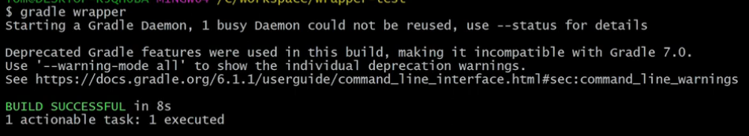
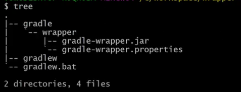

### This note is comprised of following:
  1. https://www.youtube.com/watch?v=lEfbYkacy1I&
  2. https://www.youtube.com/watch?v=R6Z-Sxb837I&
  3. CoPilot Answers

### What is Gradle: 
 - gradle basically build automation tool which takes all the code in your project and packages it into a deployable uint that can run inthe tRagert environment.
 - build.gradle.kts is equivalent to pom.xml
 - gradle is less verbose than maven

### How do I setup a new project with the Gradle Wrapper?
 - to setup a new project to use Gradle Wrapper, you need to install first gradle
 - go to gradle.org/install
 - once installed add gradle bin dir to PATH
 - make empty dir `mkdir test_wrapper`
 - `cd test_wrapper`
 - `gradle wrapper`
  
 - `tree`
  
 - `gradle-wrapper.jar` - The gradle-wrapper.jar is used to download the correct version of Gradle specified in the gradle-wrapper.properties file when you run Gradle commands. This ensures that your project builds consistently with the same Gradle version, regardless of the version installed on the local machine.

 - `gradle-wrapper.properties` - the gradle-wrapper.properties file is used to specify the version of Gradle that should be used for the project. When you run Gradle commands, this file ensures that the correct version of Gradle is downloaded and used, providing consistency in the build process regardless of the Gradle version installed on the local machine.

 - `gradlew` - build script for Linux
 - `gradlew.bat` - build script for Windows
 
 ### Should I commit these files and folder to version control?
 These files and folders should be part of the repository to ensure that anyone who clones the repository can build the project with the exact same version of Gradle, regardless of the version installed on their local machine. This provides consistency and reliability in the build process. Specifically:

- `gradle-wrapper.jar`: Ensures the correct version of Gradle is downloaded.
- `gradle-wrapper.properties`: Specifies the version of Gradle to use.
- `gradlew` and `gradlew.bat`: Scripts to run Gradle commands on Linux and Windows, respectively.

Including these files in version control ensures that all developers and CI/CD systems use the same Gradle version, avoiding potential build issues caused by version discrepancies.

